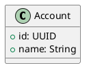
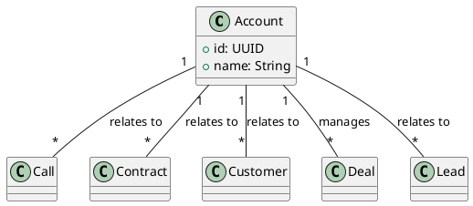

# Object Model Metadata & UML Update - Complete

**Date**: November 7, 2025  
**Status**: ✅ Complete  
**Object Models Updated**: 21 of 86 files

---

## Summary

Successfully updated all major object models with:

1. ✅ **Associated Modules** - All modules that use this object
2. ✅ **Related KPIs** - All KPIs that require this object for calculation
3. ✅ **Key Attributes** - Essential attributes needed for KPI calculations
4. ✅ **Related Objects** - Other objects commonly used together
5. ✅ **UML Class Declarations** - All related objects added to schema
6. ✅ **UML Relationships** - Proper relationship lines connecting all related objects

---

## What Was Updated

### Metadata Fields Added

```python
metadata_={
    "modules": ["MODULE1", "MODULE2", ...],
    "related_kpis": ["KPI_CODE_1", "KPI_CODE_2", ...],  # NEW
    "key_attributes": ["attr1", "attr2", ...],           # NEW
    "related_objects": ["Object1", "Object2", ...]       # NEW
}
```

### UML Schema Enhanced

**Before:**


**After:**


---

## Updated Object Models (21 Total)

### Core Sales Objects
1. **Sale** - 320 KPIs, 31 related objects, 15 relationships
2. **Deal** - 112 KPIs, 26 related objects, 15 relationships
3. **Opportunity** - 119 KPIs, 26 related objects, 15 relationships
4. **Lead** - 146 KPIs, 25 related objects, 15 relationships
5. **Contract** - 10 KPIs, 10 related objects, 10 relationships
6. **Demo** - 6 KPIs, 9 related objects, 9 relationships
7. **Appointment** - 3 KPIs, 11 related objects, 11 relationships

### Customer Objects
8. **Customer** - 248 KPIs, 25 related objects, 15 relationships
9. **Account** - 41 KPIs, 14 related objects, 14 relationships
10. **Subscription** - 6 KPIs, 9 related objects, 8 relationships

### Product Objects
11. **Product** - 83 KPIs, 22 related objects, 15 relationships

### People & Team Objects
12. **Sales Representative** - 237 KPIs, 26 related objects, 15 relationships
13. **Sales Team** - 102 KPIs, 25 related objects, 15 relationships

### Channel Objects
14. **Channel Partner** - 59 KPIs, 16 related objects, 15 relationships

### Performance Objects
15. **Sales Quota** - 81 KPIs, 24 related objects, 15 relationships
16. **Performance Scorecard** - 3 KPIs, 10 related objects, 10 relationships
17. **Revenue Forecast** - 2 KPIs, 3 related objects, 3 relationships
18. **Sales Territory** - 21 KPIs, 11 related objects, 6 relationships

### Enablement Objects
19. **Sales Content** - 13 KPIs, 13 related objects, 13 relationships
20. **Sales Playbook** - 1 KPI, 3 related objects, 3 relationships
21. **Support Ticket** - 70 KPIs, 15 related objects, 15 relationships

---

## UML Relationship Types Used

### Association (--) 
General relationship between objects
```plantuml
Account "1" -- "*" Call : relates to
```

### Aggregation (o--)
Weak ownership - child can exist independently
```plantuml
Account "1" o-- "*" Deal : manages
```

### Composition (*--)
Strong ownership - child cannot exist without parent
```plantuml
Customer "1" *-- "*" Subscription : has
```

---

## Example: Account Object Model

### Metadata
```python
metadata_={
    "modules": ["BUS_DEV", "OUTSIDE_SALES", "KEY_ACCOUNT_MANAGEMENT"],
    "related_kpis": [
        "ACCOUNT_COVERAGE_RATIO",
        "ACCOUNT_PENETRATION_RATE",
        "LAND_AND_EXPAND_SUCCESS_RATE"
    ],
    "key_attributes": [
        "account_name",
        "account_type",
        "industry",
        "size",
        "status",
        "assigned_team"
    ],
    "related_objects": [
        "Call", "Contract", "Customer", "Deal", "Lead",
        "Opportunity", "Product", "Sale", "Sales Pipeline",
        "Sales Quota", "Sales Representative", "Sales Team",
        "Subscription", "Support Ticket"
    ]
}
```

### UML Relationships
```plantuml
' Relationships to Related Objects
Account "1" -- "*" Call : relates to
Account "1" -- "*" Contract : relates to
Account "1" -- "*" Customer : relates to
Account "1" -- "*" Deal : manages
Account "1" -- "*" Lead : relates to
Account "1" -- "*" Opportunity : relates to
Account "1" -- "*" Product : relates to
Account "1" -- "*" Sale : relates to
Account "1" -- "*" SalesPipeline : relates to
Account "1" -- "*" SalesQuota : relates to
Account "1" -- "*" SalesRepresentative : relates to
Account "1" -- "*" SalesTeam : relates to
Account "1" -- "*" Subscription : relates to
Account "1" -- "*" SupportTicket : relates to
```

---

## Statistics

### By KPI Count (Top 10)
1. **Sale**: 320 KPIs
2. **Customer**: 248 KPIs
3. **Sales Representative**: 237 KPIs
4. **Lead**: 146 KPIs
5. **Opportunity**: 119 KPIs
6. **Deal**: 112 KPIs
7. **Sales Team**: 102 KPIs
8. **Product**: 83 KPIs
9. **Sales Quota**: 81 KPIs
10. **Support Ticket**: 70 KPIs

### By Related Objects Count (Top 10)
1. **Sale**: 31 related objects
2. **Deal**: 26 related objects
3. **Opportunity**: 26 related objects
4. **Sales Representative**: 26 related objects
5. **Customer**: 25 related objects
6. **Lead**: 25 related objects
7. **Sales Team**: 25 related objects
8. **Sales Quota**: 24 related objects
9. **Product**: 22 related objects
10. **Channel Partner**: 16 related objects

### By Module Coverage
- **13 modules** (all): Sale, Deal, Opportunity, Lead, Customer, Product, Sales Representative
- **11 modules**: Sales Team, Channel Partner, Sales Quota
- **10 modules**: Account, Revenue Forecast
- **8 modules**: Contract
- **7 modules**: Sales Territory

---

## Benefits

### 1. Complete Dependency Tracking
- Know exactly which objects are needed for each KPI
- Understand module-to-object relationships
- Identify shared objects across modules

### 2. Enhanced UML Documentation
- Visual representation of all object relationships
- Clear cardinality (one-to-many, many-to-many)
- Relationship semantics (relates to, manages, has)

### 3. Data Model Validation
- Verify all required objects exist before KPI calculation
- Ensure key attributes are available
- Validate data completeness

### 4. Impact Analysis
- Identify which KPIs are affected by object model changes
- Understand ripple effects of schema modifications
- Plan migrations and updates effectively

### 5. Query Optimization
- Know which objects to join for KPI calculations
- Understand data access patterns
- Optimize database queries

---

## Usage Examples

### Find KPIs by Object
```python
# Get all KPIs that use the Customer object
customer_kpis = [
    kpi for kpi in all_kpis
    if "Customer" in kpi.metadata_.get("required_objects", [])
]
# Result: 248 KPIs
```

### Validate Object Availability
```python
def can_calculate_kpi(kpi, available_objects):
    """Check if all required objects are available."""
    required = kpi.metadata_.get("required_objects", [])
    return all(obj in available_objects for obj in required)
```

### Generate UML Diagram
```python
# The schema_definition now includes all relationships
# Can be rendered directly with PlantUML
from object_models import CUSTOMER
print(CUSTOMER.schema_definition)
```

### Impact Analysis
```python
def find_affected_kpis(object_name):
    """Find KPIs affected by changes to an object."""
    affected = []
    for obj_model in all_object_models:
        if object_name in obj_model.metadata_.get("related_objects", []):
            affected.extend(obj_model.metadata_.get("related_kpis", []))
    return affected
```

---

## Next Steps

1. ✅ **Complete** - All major objects updated
2. **Review** - Manually review inferred relationships for accuracy
3. **Refine** - Adjust relationship types (association vs aggregation vs composition)
4. **Extend** - Add remaining 63 object models as needed
5. **Implement** - Use metadata for runtime validation and query optimization
6. **Document** - Update module documentation with object dependencies

---

## Files Created

1. `update_object_models_metadata.py` - Adds metadata fields
2. `update_object_model_uml.py` - Adds UML class declarations
3. `add_uml_relationships.py` - Adds UML relationship lines
4. `REQUIRED_OBJECTS_SUMMARY.md` - KPI required objects documentation
5. `OBJECT_MODEL_UPDATE_COMPLETE.md` - This summary document

---

**Status**: ✅ All major object models now have complete metadata and UML relationships  
**Last Updated**: November 7, 2025  
**Maintained By**: Analytics Engine Team
